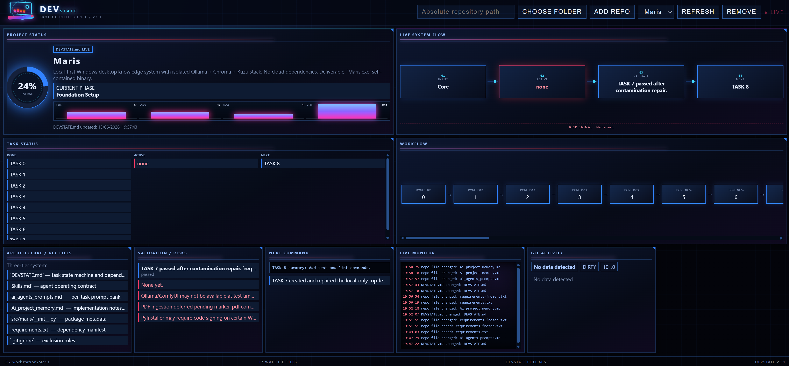

# Devstate v3.1


Local-only, read-only project status dashboard. Devstate watches configured repositories without creating or changing files inside them. Only `config.json` inside the Devstate folder is written.

## Run

Double-click `start.bat`. It finds a free local port, starts Devstate invisibly, and opens the dashboard.

No installation is required in the packaged release. Closing the dashboard tab releases the local server automatically after approximately 15 seconds.

Use **Choose Folder** or paste an absolute repository path and select **Add Repo**.

## DEVSTATE.md Contract

Devstate checks these paths in priority order every 60 seconds and immediately after watcher changes:

1. `DEVSTATE.md`
2. `.devstate/DEVSTATE.md`
3. `docs/DEVSTATE.md`

Recommended contract:

```markdown
# Meta
- Overall Percent: 72%

# Project Target
Describe the intended outcome.

# Current Phase
Integration and validation

# Progress
## Done Tasks
- Completed item
## Active Tasks
- Current item
## Next Tasks
- Next item
## Blockers
- Blocking issue

# Workflow
| Task | Status | Percent |
|---|---|---:|
| Foundation | DONE | 100% |
| Integration | ACTIVE | 60% |
| Release | TODO | 0% |

# Architecture
- API server
- Web dashboard

# Key Files
- server.js
- public/app.js

# Recent Changes
- Added live status parsing

# Risks
- Validation coverage incomplete

# Validation
- Build: passed
- Test: pending
- Lint: passed

# Next Command
npm test
```

Missing sections display `No data detected`. Overall percentage priority is explicit `Overall Percent`, computed workflow average, then repo scan heuristic.

Workflow values: `DONE=100`, `ACTIVE=listed percent or 50`, `RISK=listed percent or 40`, `BLOCKED=listed percent or 25`, `TODO=0`.

## Coding-Agent Prompt

```text
Maintain DEVSTATE.md in the repository root as the canonical project status.
After meaningful work, update Project Target, Current Phase, Progress tasks,
Workflow statuses and percentages, Architecture, Key Files, Recent Changes,
Risks, Validation, and Next Command. Keep entries factual and current.
Do not modify Devstate configuration or dashboard files.
```

## Dashboard Usage

- **Status Source** shows `DEVSTATE.md LIVE` or `Repo Scan Fallback`.
- **Live System Flow** maps active phase/task, architecture, validation, risks, and next task.
- **Live Monitor** shows DEVSTATE changes, repo file changes, and detected Git commits.
- **Refresh** performs an immediate read-only scan.
- **Remove** removes only the Devstate configuration entry.
